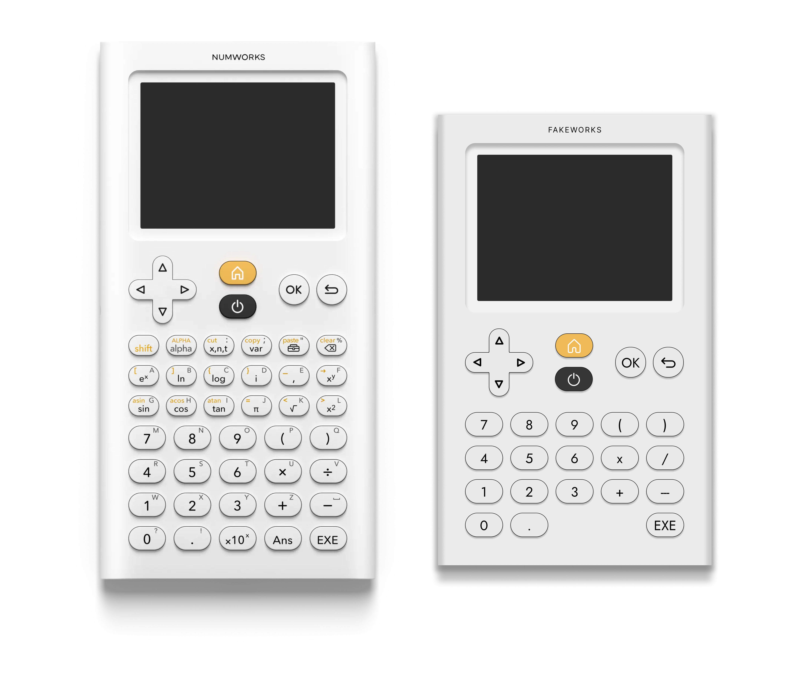

# Application

## Maquettages

Puisqu'on doit faire une calculatrice doit être réalisé, il faut en réaliser le design. Un design évident qui vient alors est celui des calculatrices Numworks. Arno a donc passé une heure à réaliser une reproduction sur figma qui n'a plus qu'à être reproduit en code. Voici le résultat :

À gauche la vraie, à droite la reproduction.