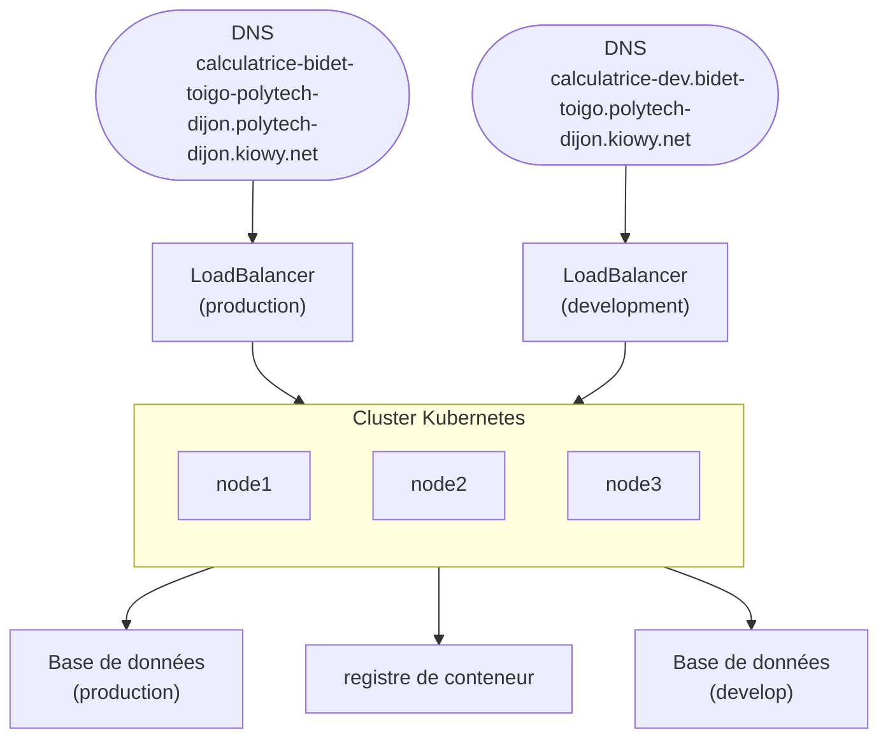

# Terraform

## Result of `terraform plan`

So let's do it :
```
$ make tf-plan
docker run --rm -v .:/foundation -w /foundation hashicorp/terraform:latest plan  

Terraform used the selected providers to generate the following execution
plan. Resource actions are indicated with the following symbols:
  + create

Terraform will perform the following actions:
```
### Databases
```
  # module.database["development"].scaleway_rdb_database.fakeworks_db will be created
  + resource "scaleway_rdb_database" "fakeworks_db" {
      + id          = (known after apply)
      + instance_id = (known after apply)
      + managed     = (known after apply)
      + name        = "fakeworks-db-development"
      + owner       = (known after apply)
      + region      = (known after apply)
      + size        = (known after apply)
    }

  # module.database["development"].scaleway_rdb_instance.fakeworks_rdb will be created
  + resource "scaleway_rdb_instance" "fakeworks_rdb" {
      + backup_same_region        = (known after apply)
      + backup_schedule_frequency = (known after apply)
      + backup_schedule_retention = (known after apply)
      + certificate               = (known after apply)
      + disable_backup            = true
      + endpoint_ip               = (known after apply)
      + endpoint_port             = (known after apply)
      + engine                    = "PostgreSQL-15"
      + id                        = (known after apply)
      + is_ha_cluster             = true
      + name                      = "fakeworks-rdb-development"
      + node_type                 = "DB-GP-S"
      + organization_id           = (known after apply)
      + password                  = (sensitive value)
      + project_id                = (known after apply)
      + read_replicas             = (known after apply)
      + region                    = (known after apply)
      + settings                  = (known after apply)
      + user_name                 = "fakeworks"
      + volume_size_in_gb         = (known after apply)
      + volume_type               = "lssd"

      + load_balancer (known after apply)

      + logs_policy (known after apply)
    }

  # module.database["production"].scaleway_rdb_database.fakeworks_db will be created
  + resource "scaleway_rdb_database" "fakeworks_db" {
      + id          = (known after apply)
      + instance_id = (known after apply)
      + managed     = (known after apply)
      + name        = "fakeworks-db-production"
      + owner       = (known after apply)
      + region      = (known after apply)
      + size        = (known after apply)
    }

  # module.database["production"].scaleway_rdb_instance.fakeworks_rdb will be created
  + resource "scaleway_rdb_instance" "fakeworks_rdb" {
      + backup_same_region        = (known after apply)
      + backup_schedule_frequency = (known after apply)
      + backup_schedule_retention = (known after apply)
      + certificate               = (known after apply)
      + disable_backup            = true
      + endpoint_ip               = (known after apply)
      + endpoint_port             = (known after apply)
      + engine                    = "PostgreSQL-15"
      + id                        = (known after apply)
      + is_ha_cluster             = true
      + name                      = "fakeworks-rdb-production"
      + node_type                 = "DB-GP-M"
      + organization_id           = (known after apply)
      + password                  = (sensitive value)
      + project_id                = (known after apply)
      + read_replicas             = (known after apply)
      + region                    = (known after apply)
      + settings                  = (known after apply)
      + user_name                 = "fakeworks"
      + volume_size_in_gb         = (known after apply)
      + volume_type               = "lssd"

      + load_balancer (known after apply)

      + logs_policy (known after apply)
    }
```

### Domain record

```
  # module.domain["development"].scaleway_domain_record.calculatrice-bidet-toigo-polytech-dijon will be created
  + resource "scaleway_domain_record" "calculatrice-bidet-toigo-polytech-dijon" {
      + data            = "1.2.3.4"
      + dns_zone        = "kiowy.net"
      + fqdn            = (known after apply)
      + id              = (known after apply)
      + keep_empty_zone = false
      + name            = "calculatrice-dev.bidet-toigo.polytech-dijon.kiowy.net"
      + priority        = (known after apply)
      + project_id      = (known after apply)
      + root_zone       = (known after apply)
      + ttl             = 3600
      + type            = "A"
    }

  # module.domain["production"].scaleway_domain_record.calculatrice-bidet-toigo-polytech-dijon will be created
  + resource "scaleway_domain_record" "calculatrice-bidet-toigo-polytech-dijon" {
      + data            = "1.2.3.4"
      + dns_zone        = "kiowy.net"
      + fqdn            = (known after apply)
      + id              = (known after apply)
      + keep_empty_zone = false
      + name            = "calculatrice.bidet-toigo.polytech-dijon.kiowy.net"
      + priority        = (known after apply)
      + project_id      = (known after apply)
      + root_zone       = (known after apply)
      + ttl             = 3600
      + type            = "A"
    }
```

### K8s cluster
```
  # module.k8s.scaleway_k8s_cluster.cluster-k8s-fakeworks will be created
  + resource "scaleway_k8s_cluster" "cluster-k8s-fakeworks" {
      + apiserver_url               = (known after apply)
      + cni                         = "cilium"
      + created_at                  = (known after apply)
      + delete_additional_resources = false
      + id                          = (known after apply)
      + kubeconfig                  = (sensitive value)
      + name                        = "tf-cluster-fakeworks"
      + organization_id             = (known after apply)
      + private_network_id          = (known after apply)
      + project_id                  = (known after apply)
      + region                      = (known after apply)
      + status                      = (known after apply)
      + type                        = (known after apply)
      + updated_at                  = (known after apply)
      + upgrade_available           = (known after apply)
      + version                     = "1.29.1"
      + wildcard_dns                = (known after apply)

      + auto_upgrade (known after apply)

      + autoscaler_config (known after apply)

      + open_id_connect_config (known after apply)
    }

  # module.k8s.scaleway_k8s_pool.pool-k8s-fakeworks will be created
  + resource "scaleway_k8s_pool" "pool-k8s-fakeworks" {
      + autohealing            = false
      + autoscaling            = false
      + cluster_id             = (known after apply)
      + container_runtime      = "containerd"
      + created_at             = (known after apply)
      + current_size           = (known after apply)
      + id                     = (known after apply)
      + max_size               = (known after apply)
      + min_size               = 1
      + name                   = "tf-pool-fakeworks"
      + node_type              = "DEV1-M"
      + nodes                  = (known after apply)
      + public_ip_disabled     = false
      + region                 = (known after apply)
      + root_volume_size_in_gb = (known after apply)
      + root_volume_type       = (known after apply)
      + size                   = 1
      + status                 = (known after apply)
      + updated_at             = (known after apply)
      + version                = (known after apply)
      + wait_for_pool_ready    = true
      + zone                   = (known after apply)

      + upgrade_policy (known after apply)
    }
```

### Virtual Private Cluster Network
```
  # module.k8s.scaleway_vpc_private_network.pn-k8s-fakeworks will be created
  + resource "scaleway_vpc_private_network" "pn-k8s-fakeworks" {
      + created_at      = (known after apply)
      + id              = (known after apply)
      + is_regional     = (known after apply)
      + name            = (known after apply)
      + organization_id = (known after apply)
      + project_id      = (known after apply)
      + region          = (known after apply)
      + updated_at      = (known after apply)
      + vpc_id          = (known after apply)
      + zone            = (known after apply)

      + ipv4_subnet (known after apply)

      + ipv6_subnets (known after apply)
    }
```

### Load balancer
```
  # module.load_balancer["development"].scaleway_lb.fakeworks_load_balancer will be created
  + resource "scaleway_lb" "fakeworks_load_balancer" {
      + assign_flexible_ip      = false
      + id                      = (known after apply)
      + ip_address              = (known after apply)
      + ip_id                   = (known after apply)
      + ip_ids                  = (known after apply)
      + ipv6_address            = (known after apply)
      + name                    = "lb-development"
      + organization_id         = (known after apply)
      + project_id              = (known after apply)
      + region                  = (known after apply)
      + ssl_compatibility_level = "ssl_compatibility_level_intermediate"
      + type                    = "LB-S"
      + zone                    = (known after apply)
    }

  # module.load_balancer["production"].scaleway_lb.fakeworks_load_balancer will be created
  + resource "scaleway_lb" "fakeworks_load_balancer" {
      + assign_flexible_ip      = false
      + id                      = (known after apply)
      + ip_address              = (known after apply)
      + ip_id                   = (known after apply)
      + ip_ids                  = (known after apply)
      + ipv6_address            = (known after apply)
      + name                    = "lb-production"
      + organization_id         = (known after apply)
      + project_id              = (known after apply)
      + region                  = (known after apply)
      + ssl_compatibility_level = "ssl_compatibility_level_intermediate"
      + type                    = "LB-M"
      + zone                    = (known after apply)
    }
```

### Container registry
```
  # module.registry.scaleway_registry_namespace.fakeworks_container_registry will be created
  + resource "scaleway_registry_namespace" "fakeworks_container_registry" {
      + description     = "Fakeworks - Container registry"
      + endpoint        = (known after apply)
      + id              = (known after apply)
      + is_public       = false
      + name            = "fakeworks-cr"
      + organization_id = (known after apply)
      + project_id      = (known after apply)
      + region          = (known after apply)
    }
```

### Command conclusion
```
Plan: 12 to add, 0 to change, 0 to destroy.

─────────────────────────────────────────────────────────────────────────────

Note: You didn't use the -out option to save this plan, so Terraform can't
guarantee to take exactly these actions if you run "terraform apply" now.
```

## Schema of what is planned 


