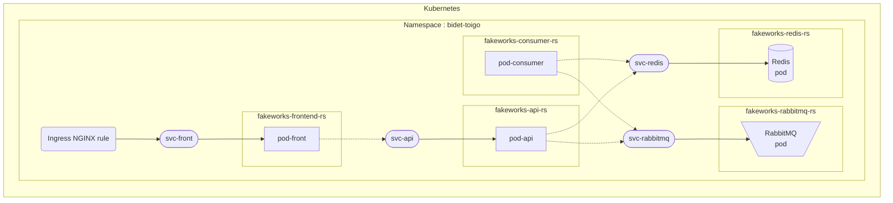

# Kubernetes

## Requirements

**Important** : You need to put a `config.yaml` file in  the config folder.

It should look like this :

```yaml
apiVersion: v1
clusters:
- cluster:
    certificate-authority-data:  AUTHORITY_DATA
    server: https://34.78.49.219
  name: k8s-polytech-dijon-9m87
contexts:
- context:
    cluster: k8s-polytech-dijon-9m87
    namespace: bidet-toigo
    user: student
  name: student-k8s-polytech-dijon-9m87
current-context: student-k8s-polytech-dijon-9m87
kind: Config
preferences: {}
users:
- name: student
  user:
    client-certificate-data:  CLIENT_CERTIFICATE
    client-key-data: KEY_DATA
```

## Deploy

To deploy our app fast and easy, you may use the commands of our `Makefile`.

As stated in the readme of the application part, I hate to install things on my computer, this is the reason why Kubernetes is containerized.

Use the command `make setup` to deploy our app.

**Important :** The command is thought to be used in a linux or IOS environment.

## Organization

So I was in the lookout for a good way to architect our k8s. I asked chatGPT for the good practices. It went something like this :

- In Kubernetes, how to organize the files ?

- Organizing Kubernetes files effectively is crucial for maintainability, scalability, and collaboration in a project. Below is a common directory structure and best practices to keep your Kubernetes manifests organized.

```
├── k8s/
│   ├── namespaces/
│   │   ├── dev.yaml
│   │   ├── prod.yaml
│   ├── apps/
│   │   ├── my-app/
│   │   │   ├── deployment.yaml
│   │   │   ├── service.yaml
│   │   │   ├── ingress.yaml
│   │   └── another-app/
│   │       ├── deployment.yaml
│   │       ├── service.yaml
│   │       ├── configmap.yaml
│   ├── configs/
│   │   ├── global-configmap.yaml
│   │   ├── secrets.yaml
│   ├── storage/
│   │   ├── pv.yaml
│   │   ├── pvc.yaml
│   ├── crds/
│   │   ├── customresource.yaml
│   ├── environment/
│   │   ├── dev/
│   │   │   ├── my-app/
│   │   │   │   ├── deployment.yaml
│   │   │   │   ├── configmap.yaml
│   │   │   └── another-app/
│   │   │       ├── service.yaml
│   │   └── prod/
│   │       ├── ...
└── helm-charts/
```

So, we won't be using all this stuff, but we take the idea of a file per kind of resource, and a file name consistency that describes the kind of resources, distributed in folders that describe logical functionnalities.

```
.
├── apps
│   ├── api
│   │   ├── deployment.yaml
│   │   └── service.yaml
│   ├── consumer
│   │   └── deployment.yaml
│   ├── frontend
│   │   ├── deployment.yaml
│   │   └── service.yaml
│   ├── ingress.yaml
│   ├── rabbitmq
│   │   ├── deployment.yaml
│   │   └── service.yaml
│   └── redis
│       ├── deployment.yaml
│       └── service.yaml
└── configs
    └── config.yaml
```

First and foremost, we see that all services do not have the same kind of resources needed. Container-wise, the `consumer` doesn't need a `service.yaml`, as it is not exposed to other containers.

Then, we go deeper in the analysis, looking at container interconnexions.

Without an inch of surprise, we find what was described in the subject :

